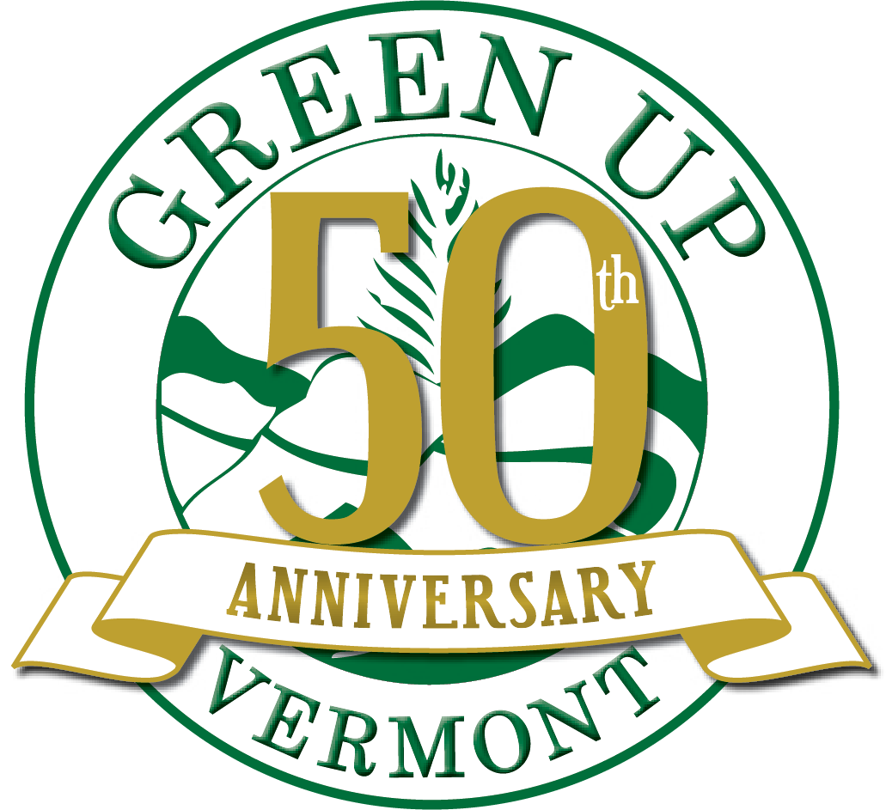

# Green Up App

<p align="center">
  
</p>

This repository contains the source code for the Green Up App, a mobile app for Vermont's Green Up Day. Green Up App is an official Code for America Project. More information about the motivation and context of this project is available on the [Code for BTV Website](http://codeforbtv.org/projects/greenup-app).

## How you can contribute

See the [CONTRIBUTING](./CONTRIBUTING.md) page for details on how to contribute.

## Setting up your development environment
The easiest way to start contributing is by skipping the setup process and using GitPod in your browser by clicking here:
(https://gitpod.io/#https://github.com/codeforbtv/green-up-app)

You won't be able to run the code without a environment.js file. and template for this file can be found in environment.example.js 
Setup a Firebase app and use those app settings to configure environment.js,    
Get your own Firebase database here (https://firebase.google.com/) or, if you want to contribute to this project, find us on [Slack](https://codeforbtv.slack.com/) and we'll gladly share ours. Not on our Slack board?  [Get an invitation.](https://cfbtv-slackin.herokuapp.com/) 
 
Install the [expo client](https://expo.io/tools#client) on your phone

Run the project in the root folder.

```expo start```

## Licensing

See the [LICENSE](./LICENSE.md) page for details on the license.

## Download the app from your favorite App Store
[](https://play.google.com/store/apps/details?id=org.greenupvermont.app)

[](https://itunes.apple.com/us/app/green-up-vermont/id1364770239?mt=8)
